# 🏗️ ORACLE Alpha Architecture

## High-Level Overview


## Data Flow


## Scoring Algorithm Flow


## On-Chain Data Structure


## Infrastructure

```mermaid
flowchart TB
    subgraph Cloud["☁️ Deployment"]
        DOCKER[Docker Container]
        PM2[PM2 Process Manager]
    end

    subgraph Monitoring["📈 Monitoring"]
        PROM[Prometheus Metrics]
        HEALTH[Health Checks]
        LOGS[JSON Logging]
    end

    subgraph External["🌐 External Services"]
        HELIUS[Helius RPC]
        SOLRPC[Solana RPC]
        TGAPI[Telegram API]
        DCAPI[Discord API]
    end

    DOCKER --> PM2
    PM2 --> Monitoring
    Cloud --> External
```



## Subscription Tiers

| Tier | Price | Features | Rate Limit |
|------|-------|----------|------------|
| Free | $0 | Public signals, delayed 15min | 10 req/hour |
| Basic | $29/mo | Real-time, API access | 100 req/hour |
| Pro | $99/mo | Webhooks, backtesting | 1000 req/hour |
| Elite | $299/mo | Custom sources, priority | Unlimited |

## Payout Structure

```
Signal Provider Payouts (70/20/10):
├── 70% → Signal Source Provider
├── 20% → ORACLE Platform
└── 10% → Stakers/Token Holders
```

---

*Architecture designed for scalability, verifiability, and trustless operation.*
